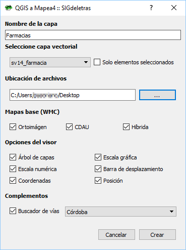
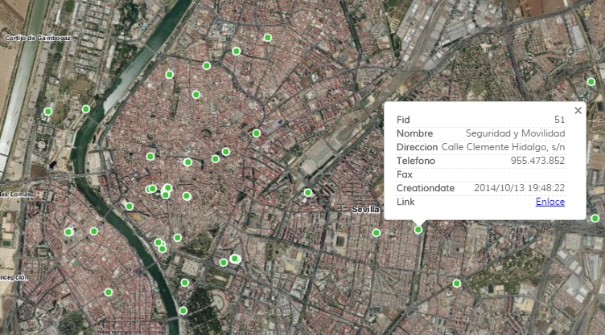

# QGIS2Mapea4 (V0.1) 

**Complemento para QGIS 3 que crea un visor de mapas web a partir de una capa vectorial usando la API Mapea4 con datos ubicados geográficamente en Andalucia (España)**.

Toda la información sobre la API Mapea4 desarollada dentro del SIG Corporativo de la Junta de Andalucía puede ser consultada en el siguiente repositorio [https://github.com/sigcorporativo-ja/Mapea4](https://github.com/sigcorporativo-ja/Mapea4)

Para más información puede consultarse la entrada en [SIGdeletras.com](http://www.sigdeletras.com/2017/blog/plugin-de-qgis-para-descarga-de-datos-catastrales-inspire/)

## Instalación plugin

El complemento puede ser instalado desde el menú <b>Complementos>Administrar e instalar complementos</b> de QGIS. Para localizar de forma rápida el complemento puede introducirse el término <i>"mapea"</i> en la herramienta de búsqueda.

Igualmente, puede descargarse el código en formato zip o realizar un *clone* de este repositorio e instalar el QGIS2Mpaea4 desde la herramienta de instalar mediante zip que incluye el Administrador de complementos de QGIS a partir de la versión 3.

## Usos y opciones

Ejecutando el complemento desde el el icono  o desde el menú **Web>QGIS a Mapea4**, aparecerá un formulario con las distintas opciones del complemento.

- **Nombre de la capa**. Se podrá añadir el nombre de la capa que aparecerá en el visor.
- **Selección de capa vectorial**. Presenta un desplegable con las capas desplegables cargadas en el proyecto de QGIS. En el caso de tener elementos seleccionados permite crear el visor solo con ellos.
- **Ubicación de archivos**: Directorio local donde se creará la carpeta con los ficheros del visor.
- **Mapas base**: Permite seleccionar los mapas base del visor. En esta versión son los datos del proyecto de Callejero Digital de Andalucía Unificado (CDAU), ortoimagen y/o combinación de ambos.
- **Opciones del visor**. Permite añadir distintas opciones y herramientas al visor incluidas en Mapea4
- **Complementos**: Al API permite añadir un conjunto variado de [complementos](https://github.com/sigcorporativo-ja/Mapea4/wiki/Plugins). 

En QGIS2Mapea4 se ha añadido el complemento de búsqueda de callejero. Una vez activado, se debe seleccionar alguno de los municipios de Andalucía.

## Consulta de atributos

Gracias a Mapea4, se puede de forma automática acceder a los atributos de la capa publicada simplemente haciendo clic en alguna de las geometrías.

## Añadir el visor a nuestra web.

La carpeta generada puede ser subida directamente a un hospedaje web. Accediendo a la URL dominio y completando con la ubicación de los ficheros tendremos la dirección del visor.  Por ejemplo http

Podemos también embeber el visor a una publicación de nuestra web o blog. Para ello se añadirá la dirección del visor dentro de una etiqueta <iframe> y los parámetros básicos para su configuración.

El código de ejemplos y el resultado lo tenéis a continuación.

	<iframe width="525" height="350" frameborder="0" scrolling="no" marginheight="0" marginwidth="0" 
	src=""> </iframe> 

## 2DO

- Seleccionar varias capas vectoriales
- Ampliar los complementos de Mapea4 a instalar
- Aplicación de simbilogías para mapas temáticos (coropletas, categorizados, cluster)

## Changelog
- 02.07.2018 V0.1: Primera versión
